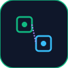
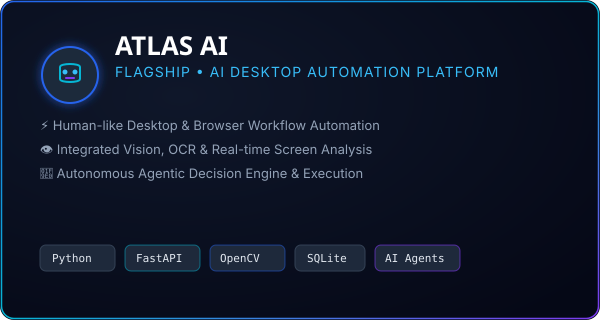
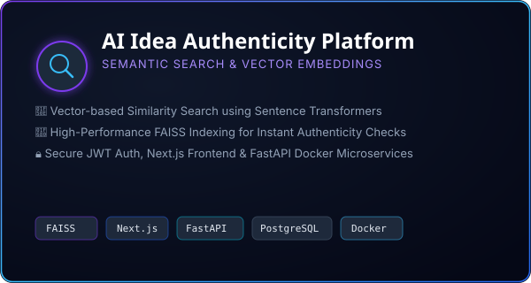
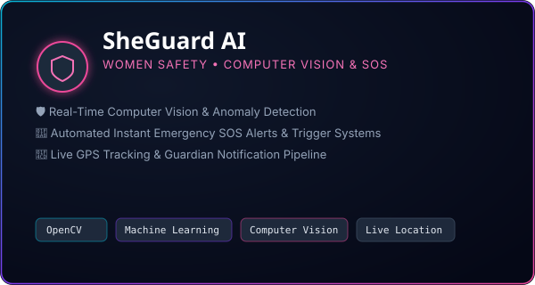
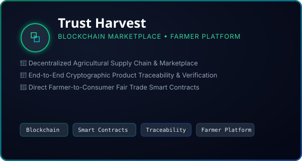

  <!-- 01. ANIMATED HERO HEADER BANNER -->
  

   

  <!-- DYNAMIC TYPING SVG ANIMATION -->
  

  <!-- VISITOR COUNTER & CORE BADGES -->
  

    
    
    
    
  

<!-- DIVIDER SVG -->

  

<!-- ==================================================================== -->
<!-- 02. ABOUT ME & CORE BIOGRAPHY                                        -->
<!-- ==================================================================== -->

<table width="100%" style="border-collapse: collapse; background-color: #0F172A; border-radius: 12px; margin-bottom: 12px;">
  <tr>
    <td style="padding: 18px 22px; background: linear-gradient(135deg, rgba(15,23,42,0.95) 0%, rgba(5,8,22,0.98) 100%); border: 1px solid rgba(37,99,235,0.4); border-radius: 12px;">
      
      <table width="100%" style="border-collapse: collapse;">
        <tr>
          <td width="64%" valign="top">
            <h2 align="left" style="color: #FFFFFF; font-family: 'Space Grotesk', sans-serif; font-size: 22px; margin: 0 0 10px 0;">
               &nbsp; Executive Brief &amp; Bio
            </h2>
            

              Greetings! I am <b>Bindudhara D</b>, an <b>AI &amp; Data Science Undergraduate</b>, <b>AI Engineer</b>, and <b>Full Stack Developer</b> based in Bangalore, India.
            

            

              I specialize in engineering autonomous <b>Agentic AI Platforms</b>, high-speed <b>Computer Vision Engines</b>, and distributed <b>Full-Stack Microservices</b>. My mission is building zero-friction intelligent automation tools that bridge cognitive reasoning with real-world computer interactions.
            

            <h4 style="color: #38BDF8; font-family: 'Space Grotesk', sans-serif; font-size: 14px; margin: 0 0 6px 0;">
              ⚡ Core Focus Domains:
            </h4>
            <table width="100%" style="font-family: 'Inter', sans-serif; font-size: 13px; color: #CBD5E1;">
              <tr>
                <td width="50%">• 🤖 <b>Agentic AI &amp; LLM Systems</b></td>
                <td width="50%">• 👁️ <b>Computer Vision &amp; OCR</b></td>
              </tr>
              <tr>
                <td>• ⚡ <b>Desktop &amp; OS Automation</b></td>
                <td>• 🔍 <b>Semantic Search &amp; FAISS</b></td>
              </tr>
              <tr>
                <td>• 💻 <b>Full Stack Architecture</b></td>
                <td>• 📊 <b>DSA &amp; System Design</b></td>
              </tr>
            </table>
          </td>
          <td width="36%" valign="middle" align="center" style="padding-left: 16px;">
            <!-- GLASSMORPHIC STAT CARD -->
            

              
              <h3 style="color: #38BDF8; font-family: 'Space Grotesk', sans-serif; margin: 6px 0 2px 0; font-size: 18px;">ATLAS AI</h3>
              
FLAGSHIP INITIATIVE

              

                Autonomous desktop engine for vision-guided human task execution.
              

              
            

          </td>
        </tr>
      </table>

    </td>
  </tr>
</table>

<!-- DIVIDER SVG -->

  

<!-- ==================================================================== -->
<!-- 03. CURRENT MISSION & HIGHLIGHTED GOALS                              -->
<!-- ==================================================================== -->

<h2 align="center" style="color: #FFFFFF; font-family: 'Space Grotesk', sans-serif; font-size: 22px; margin: 10px 0 4px 0;">
  🎯 Current Mission &amp; Autonomous Focus
</h2>

  Architecting software at the bleeding edge of Artificial General Intelligence and Human-Computer Interaction

<table width="100%" style="border-collapse: separate; border-spacing: 12px 0; margin-bottom: 12px;">
  <tr>
    <td width="33%" valign="top" style="background: #0F172A; border: 1px solid rgba(37, 99, 235, 0.4); border-radius: 10px; padding: 16px;">
      

        
        <h3 style="color: #38BDF8; font-family: 'Space Grotesk', sans-serif; font-size: 16px; margin: 8px 0 4px 0;">01. Agentic Intelligence</h3>
        

          Building multi-agent reinforcement frameworks where LLMs interact dynamically with local desktop applications and web APIs.
        

      

    </td>
    <td width="33%" valign="top" style="background: #0F172A; border: 1px solid rgba(124, 58, 237, 0.4); border-radius: 10px; padding: 16px;">
      

        
        <h3 style="color: #C084FC; font-family: 'Space Grotesk', sans-serif; font-size: 16px; margin: 8px 0 4px 0;">02. Computer Vision</h3>
        

          Engineered real-time object identification, spatial mapping, and OCR analysis pipelines utilizing OpenCV and PyTorch.
        

      

    </td>
    <td width="33%" valign="top" style="background: #0F172A; border: 1px solid rgba(6, 182, 212, 0.4); border-radius: 10px; padding: 16px;">
      

        
        <h3 style="color: #22D3EE; font-family: 'Space Grotesk', sans-serif; font-size: 16px; margin: 8px 0 4px 0;">03. Scalable Systems</h3>
        

          Crafting resilient asynchronous backends in FastAPI/Node.js coupled with vector databases (FAISS) and PostgreSQL microservices.
        

      

    </td>
  </tr>
</table>

<!-- DIVIDER SVG -->

  

<!-- ==================================================================== -->
<!-- 04. FEATURED PROJECTS SHOWCASE (COMPACT 2x2 GRID)                    -->
<!-- ==================================================================== -->

<h2 align="center" style="color: #FFFFFF; font-family: 'Space Grotesk', sans-serif; font-size: 22px; margin: 10px 0 4px 0;">
  ⭐ Featured Innovations &amp; Flagship Projects
</h2>

  Production-grade architectures crafted with elegance, security, and computational efficiency

<!-- ROW 1: ATLAS AI & AI IDEA AUTHENTICITY -->

<table width="100%" style="border-collapse: separate; border-spacing: 12px 0; margin-bottom: 12px;">
  <tr>
    <!-- PROJECT 1: ATLAS AI -->
    <td width="50%" valign="top" style="background: #0F172A; border: 1px solid rgba(37, 99, 235, 0.5); border-radius: 10px; padding: 16px;">
      
      <h3 style="color: #FFFFFF; font-family: 'Space Grotesk', sans-serif; font-size: 18px; margin: 10px 0 2px 0;">
        ⭐ ATLAS AI — Desktop Automation Platform
      </h3>
      

        FLAGSHIP PROJECT  •  AI-POWERED AUTONOMOUS AGENT
      

      

        Autonomous desktop agent platform operating software with human-like precision. Powered by computer vision, OCR, and real-time screen understanding.
      

      

        
        
        
        
      

    </td>

    <!-- PROJECT 2: AI IDEA AUTHENTICITY -->
    <td width="50%" valign="top" style="background: #0F172A; border: 1px solid rgba(124, 58, 237, 0.5); border-radius: 10px; padding: 16px;">
      
      <h3 style="color: #FFFFFF; font-family: 'Space Grotesk', sans-serif; font-size: 18px; margin: 10px 0 2px 0;">
        ⭐ AI Idea Authenticity Platform
      </h3>
      

        SEMANTIC SEARCH  •  VECTOR EMBEDDINGS  •  FAISS
      

      

        Evaluates startup ideas &amp; research proposals for authenticity using dense vector representations, Sentence Transformers, and FAISS indexing.
      

      

        
        
        
        
      

    </td>
  </tr>
</table>

<!-- ROW 2: SHEGUARD AI & TRUST HARVEST -->
<table width="100%" style="border-collapse: separate; border-spacing: 12px 0; margin-bottom: 12px;">
  <tr>
    <!-- PROJECT 3: SHEGUARD AI -->
    <td width="50%" valign="top" style="background: #0F172A; border: 1px solid rgba(6, 182, 212, 0.5); border-radius: 10px; padding: 16px;">
      
      <h3 style="color: #FFFFFF; font-family: 'Space Grotesk', sans-serif; font-size: 18px; margin: 10px 0 2px 0;">
        ⭐ SheGuard AI — Women Safety Platform
      </h3>
      

        COMPUTER VISION  •  EMERGENCY ALERTS  •  LIVE GPS
      

      

        Intelligent emergency detection system leveraging computer vision threat assessment, automated live GPS tracking, and instant SOS alerts.
      

      

        
        
        
      

    </td>

    <!-- PROJECT 4: TRUST HARVEST -->
    <td width="50%" valign="top" style="background: #0F172A; border: 1px solid rgba(16, 185, 129, 0.5); border-radius: 10px; padding: 16px;">
      
      <h3 style="color: #FFFFFF; font-family: 'Space Grotesk', sans-serif; font-size: 18px; margin: 10px 0 2px 0;">
        ⭐ Trust Harvest — Blockchain Marketplace
      </h3>
      

        BLOCKCHAIN  •  FARMER PLATFORM  •  TRACEABILITY
      

      

        Decentralized agricultural supply chain marketplace empowering farmers with direct market access, produce provenance, and smart contracts.
      

      

        
        
        
      

    </td>
  </tr>
</table>

<!-- DIVIDER SVG -->

  

<!-- ==================================================================== -->
<!-- 05. COMPREHENSIVE TECH STACK & ARSENAL                               -->
<!-- ==================================================================== -->

<h2 align="center" style="color: #FFFFFF; font-family: 'Space Grotesk', sans-serif; font-size: 22px; margin: 10px 0 4px 0;">
  🛠️ Technical Stack &amp; Engineering Arsenal
</h2>

  Technologies, frameworks, and database engines leveraged across production systems

<table width="100%" style="background: #0F172A; border: 1px solid rgba(37, 99, 235, 0.3); border-radius: 10px; border-collapse: collapse; margin-bottom: 12px;">
  
  <tr>
    <td width="24%" style="padding: 10px 14px; border-bottom: 1px solid rgba(51, 65, 85, 0.6); color: #38BDF8; font-family: 'Space Grotesk', sans-serif; font-weight: 700; font-size: 13px;">
      💻 Programming
    </td>
    <td style="padding: 10px 14px; border-bottom: 1px solid rgba(51, 65, 85, 0.6);">
      
      
      
      
    </td>
  </tr>

  <tr>
    <td style="padding: 10px 14px; border-bottom: 1px solid rgba(51, 65, 85, 0.6); color: #C084FC; font-family: 'Space Grotesk', sans-serif; font-weight: 700; font-size: 13px;">
      🤖 Artificial Intelligence
    </td>
    <td style="padding: 10px 14px; border-bottom: 1px solid rgba(51, 65, 85, 0.6);">
      
      
      
      
      
    </td>
  </tr>

  <tr>
    <td style="padding: 10px 14px; border-bottom: 1px solid rgba(51, 65, 85, 0.6); color: #38BDF8; font-family: 'Space Grotesk', sans-serif; font-weight: 700; font-size: 13px;">
      🌐 Web &amp; Frontend
    </td>
    <td style="padding: 10px 14px; border-bottom: 1px solid rgba(51, 65, 85, 0.6);">
      
      
      
      
      
    </td>
  </tr>

  <tr>
    <td style="padding: 10px 14px; border-bottom: 1px solid rgba(51, 65, 85, 0.6); color: #34D399; font-family: 'Space Grotesk', sans-serif; font-weight: 700; font-size: 13px;">
      ⚡ Backend Systems
    </td>
    <td style="padding: 10px 14px; border-bottom: 1px solid rgba(51, 65, 85, 0.6);">
      
      
      
      
    </td>
  </tr>

  <tr>
    <td style="padding: 10px 14px; color: #F472B6; font-family: 'Space Grotesk', sans-serif; font-weight: 700; font-size: 13px;">
      🗄️ Databases &amp; Cloud
    </td>
    <td style="padding: 10px 14px;">
      
      
      
      
      
      
    </td>
  </tr>

</table>

<!-- DIVIDER SVG -->

  

<!-- ==================================================================== -->
<!-- 06. AI JOURNEY & TIMELINE ROADMAP                                    -->
<!-- ==================================================================== -->

<h2 align="center" style="color: #FFFFFF; font-family: 'Space Grotesk', sans-serif; font-size: 22px; margin: 10px 0 4px 0;">
  🚀 AI Engineering Journey &amp; Milestones
</h2>

  Evolution from foundational computer science to autonomous AI systems engineering

<table width="100%" style="background: #0F172A; border: 1px solid rgba(124, 58, 237, 0.4); border-radius: 10px; padding: 16px; margin-bottom: 12px;">
  <tr>
    <td width="16%" valign="top" style="padding-right: 10px;">
      <h3 style="color: #38BDF8; font-family: 'Space Grotesk', sans-serif; margin: 0; font-size: 16px;">2023</h3>
      
GENESIS

    </td>
    <td valign="top" style="padding-left: 10px;">
      <h4 style="color: #FFFFFF; font-family: 'Space Grotesk', sans-serif; margin: 0 0 4px 0; font-size: 15px;">
        Foundations in AI, Data Science &amp; DSA
      </h4>
      

        Initiated AI &amp; Data Science undergraduate program. Mastered C++, Data Structures &amp; Algorithms, Object-Oriented Design, and Python.
      

    </td>
  </tr>
  <tr><td colspan="2">
</td></tr>
  <tr>
    <td width="16%" valign="top" style="padding-right: 10px;">
      <h3 style="color: #C084FC; font-family: 'Space Grotesk', sans-serif; margin: 0; font-size: 16px;">2024</h3>
      
VISION &amp; STACK

    </td>
    <td valign="top" style="padding-left: 10px;">
      <h4 style="color: #FFFFFF; font-family: 'Space Grotesk', sans-serif; margin: 0 0 4px 0; font-size: 15px;">
        Computer Vision &amp; Web Platform Architecture
      </h4>
      

        Engineered <b>SheGuard AI</b> incorporating OpenCV real-time visual monitoring. Built <b>Trust Harvest</b> blockchain platform.
      

    </td>
  </tr>
  <tr><td colspan="2">
</td></tr>
  <tr>
    <td width="16%" valign="top" style="padding-right: 10px;">
      <h3 style="color: #22D3EE; font-family: 'Space Grotesk', sans-serif; margin: 0; font-size: 16px;">2025</h3>
      
SEMANTIC AI

    </td>
    <td valign="top" style="padding-left: 10px;">
      <h4 style="color: #FFFFFF; font-family: 'Space Grotesk', sans-serif; margin: 0 0 4px 0; font-size: 15px;">
        Vector Indexing &amp; High-Performance Retrieval
      </h4>
      

        Deployed <b>AI Idea Authenticity Platform</b> utilizing FAISS vector stores, Sentence Transformers, and Dockerized FastAPI endpoints.
      

    </td>
  </tr>
  <tr><td colspan="2">
</td></tr>
  <tr>
    <td width="16%" valign="top" style="padding-right: 10px;">
      <h3 style="color: #34D399; font-family: 'Space Grotesk', sans-serif; margin: 0; font-size: 16px;">2026+</h3>
      
AUTONOMY

    </td>
    <td valign="top" style="padding-left: 10px;">
      <h4 style="color: #FFFFFF; font-family: 'Space Grotesk', sans-serif; margin: 0 0 4px 0; font-size: 15px;">
        ATLAS AI &amp; Agentic Desktop Systems
      </h4>
      

        Pioneering <b>ATLAS AI</b> — an autonomous vision-guided OS automation agent performing complex human workflows with low latency.
      

    </td>
  </tr>
</table>

<!-- DIVIDER SVG -->

  

<!-- ==================================================================== -->
<!-- 07. GITHUB ANALYTICS & TELEMETRY                                     -->
<!-- ==================================================================== -->

<h2 align="center" style="color: #FFFFFF; font-family: 'Space Grotesk', sans-serif; font-size: 22px; margin: 10px 0 4px 0;">
  📊 GitHub Analytics &amp; Telemetry
</h2>

  Real-time engineering metrics, code contributions, and activity tracking

  <table width="100%" style="border-collapse: collapse;">
    <tr>
      <td width="50%" align="center" style="padding: 4px;">
        
      </td>
      <td width="50%" align="center" style="padding: 4px;">
        
      </td>
    </tr>
    <tr>
      <td width="50%" align="center" style="padding: 4px;">
        
      </td>
      <td width="50%" align="center" style="padding: 4px;">
        
      </td>
    </tr>
  </table>

<!-- CONTRIBUTION SNAKE ANIMATION -->
<h3 align="center" style="color: #FFFFFF; font-family: 'Space Grotesk', sans-serif; font-size: 18px; margin: 16px 0 6px 0;">
  🐍 Contribution Grid Snake Telemetry
</h3>

  <picture>
    <source media="(prefers-color-scheme: dark)" srcset="assets/github-contribution-grid-snake-dark.svg" />
    <source media="(prefers-color-scheme: light)" srcset="assets/github-contribution-grid-snake.svg" />
    
  </picture>

<!-- GITHUB TROPHIES -->
<h3 align="center" style="color: #FFFFFF; font-family: 'Space Grotesk', sans-serif; font-size: 18px; margin: 16px 0 6px 0;">
  🏆 Engineering Trophies &amp; Achievements
</h3>

  

<!-- DIVIDER SVG -->

  

<!-- ==================================================================== -->
<!-- 08. WISDOM & FOCUS AUDIO STREAM                                      -->
<!-- ==================================================================== -->

<table width="100%" style="border-collapse: separate; border-spacing: 12px 0; margin-bottom: 12px;">
  <tr>
    <td width="50%" valign="top" style="background: #0F172A; border: 1px solid rgba(37, 99, 235, 0.4); border-radius: 10px; padding: 14px;">
      <h3 style="color: #38BDF8; font-family: 'Space Grotesk', sans-serif; font-size: 15px; margin: 0 0 6px 0;">
        💡 Developer Wisdom
      </h3>
      

        "Simplicity is prerequisite for reliability. The best way to predict the future is to invent it."
      

      

        — Edsger W. Dijkstra &amp; Alan Kay
      

    </td>

    <td width="50%" valign="top" style="background: #0F172A; border: 1px solid rgba(16, 185, 129, 0.4); border-radius: 10px; padding: 14px;">
      <h3 style="color: #34D399; font-family: 'Space Grotesk', sans-serif; font-size: 15px; margin: 0 0 6px 0;">
        🎧 Cyber Beats &amp; Focus Mode
      </h3>
      

        
        

          

            Synthwave / Deep Focus Lofi
          

          

            Coding @ 3:00 AM • Deep Work Audio Stream
          

        

      

    </td>
  </tr>
</table>

<!-- DIVIDER SVG -->

  

<!-- ==================================================================== -->
<!-- 09. CONNECT & FOOTER                                                 -->
<!-- ==================================================================== -->

<h2 align="center" style="color: #FFFFFF; font-family: 'Space Grotesk', sans-serif; font-size: 22px; margin: 10px 0 4px 0;">
  🌐 Connect &amp; Collaborate
</h2>

  Open for AI research collaborations, consulting, and full-stack product building

  
  &nbsp;
  
  &nbsp;
  
  &nbsp;
  

<!-- FOOTER SVG BANNER -->

  

